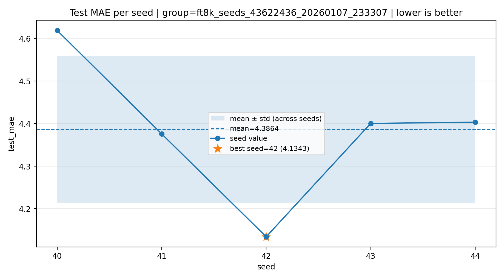
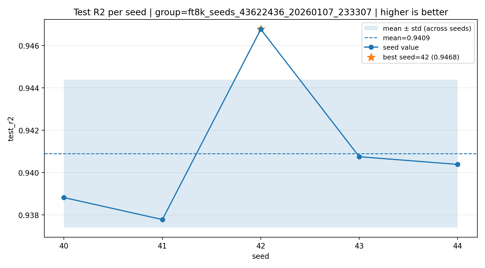
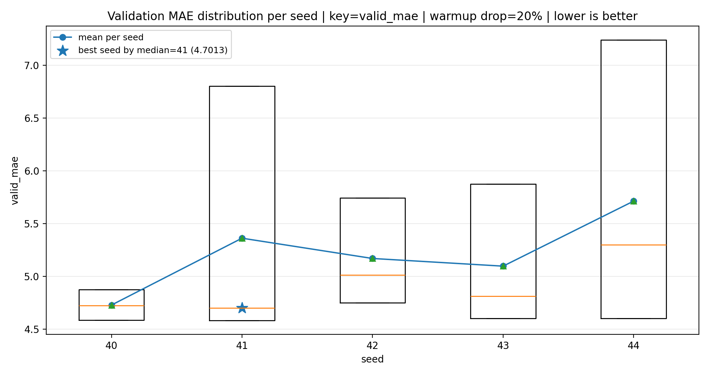
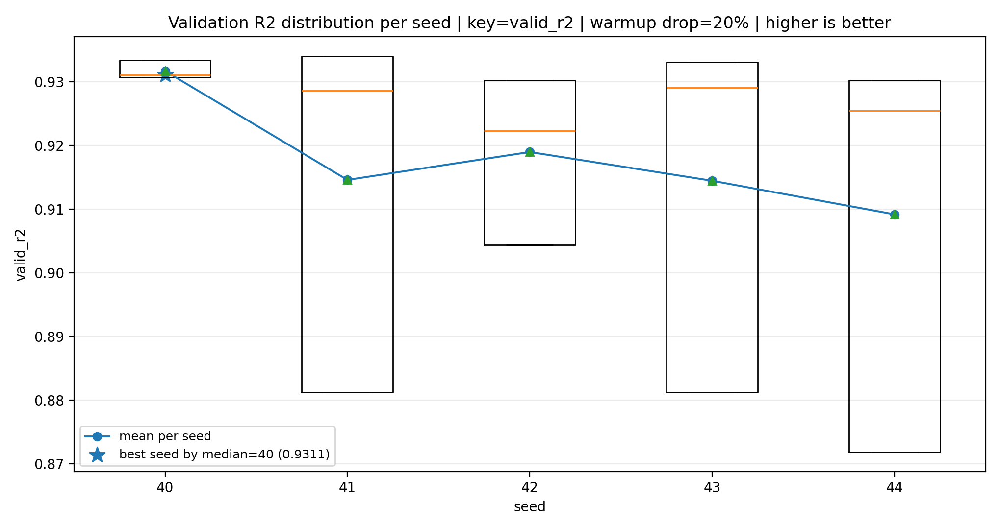
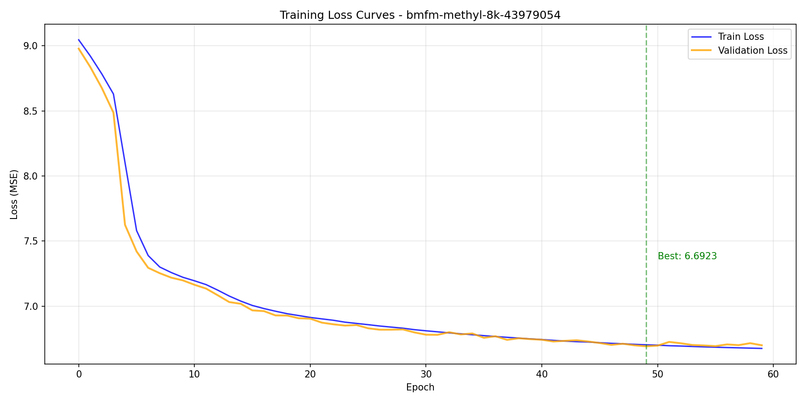
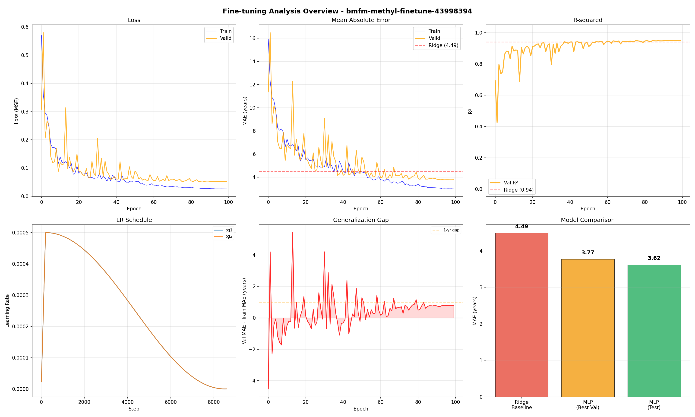
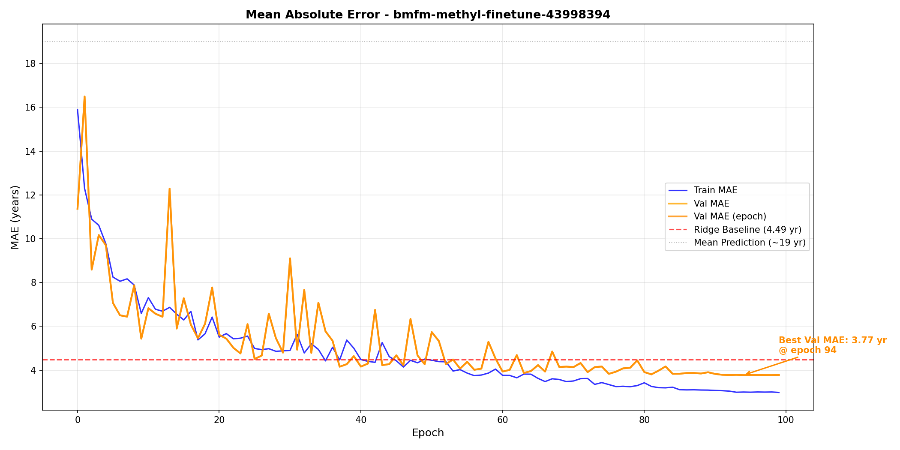
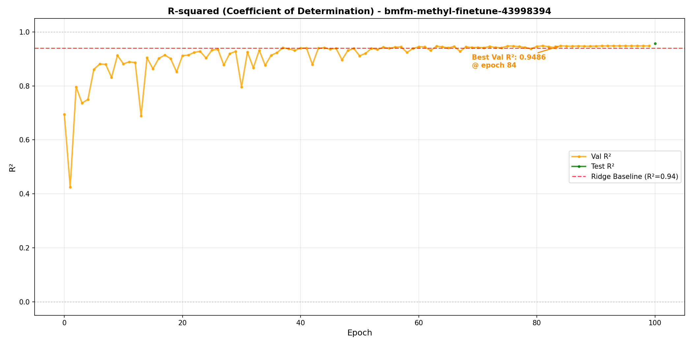

# Methylation-Based Age Prediction: BMFM-RNA vs MethylGPT

This project investigates DNA methylation-based biological age prediction using Transformer foundation models. We establish a baseline with **MethylGPT** and evaluate our adapted **BMFM-RNA** architecture.

**Paper Reference:** [MethylGPT: a foundation model for the DNA methylome (bioRxiv 2024)](https://www.biorxiv.org/content/10.1101/2024.10.30.621013v2)

---

## 1. Introduction

DNA methylation provides strong signals for age prediction, but the data are high-dimensional and noisy. We use Transformer-based foundation models to learn sample-level representations from CpG tokens. This project:

1. Establishes a stable **8K-CpG baseline** using MethylGPT
2. Adapts the **BMFM-RNA** (IBM's SCBert) architecture for methylation data
3. Compares both approaches on the same dataset and evaluation protocol

---

## 2. Data Description

| Item | Description |
|------|-------------|
| **Pretraining sources** | EWAS Data Hub; ClockBase |
| **Collected profiles** | 226,555 |
| **After QC + deduplication** | 154,063 |
| **Platforms** | Illumina 27K / 450K / EPIC |
| **CpG harmonization** | 49,156 sites (≥5 EWAS traits and/or ≥95% presence) |
| **Value range** | β-values in [0,1] |
| **Fine-tuning samples** | 11,453 (train/valid/test = 48/12/40 split) |
| **CpG sites used** | 8,000 per sample |
| **Age range** | 0–100 years |
| **Tissue composition** | Blood ~47.2%, Brain ~34.5%, Others ~18.3% |

---

## 3. Baseline Architecture (MethylGPT)

MethylGPT is based on the scGPT TransformerModel architecture:

| Component | Pretraining | Fine-tuning |
|-----------|-------------|-------------|
| **Base model** | TransformerModel (scGPT) | Same (frozen/low LR) |
| **Encoder** | CpG embeddings | Same |
| **Value encoder** | ContinuousValueEncoder | Same |
| **Transformer** | 6 layers, 4 heads, d=64 | Same (loaded from pretrained) |
| **Task head** | ExprDecoder (MLM) + MVCDecoder | ResNet1D age head |
| **Output** | Methylation reconstruction | Single age prediction |
| **Dropout** | 0.1 | 0.0 |
| **Mask ratio** | 30% | 0% |

**Why this model fits:** Methylation profiles contain structured CpG dependencies that benefit from self-attention. Pretraining on large-scale data learns generalizable token representations that transfer to the 8K-CpG setting.

---

## 4. Loss Function

- **Pretraining:** Masked MSE to reconstruct methylation values (MLM) with 30% mask ratio, plus profile-level reconstruction
- **Fine-tuning:** MSE on normalized chronological age (no masking)

---

## 5. Evaluation Plan

- **Split:** Fixed 48/12/40 train/valid/test
- **Model selection:** Best validation MAE
- **Generalization:** Multiple random seeds (40–44)
- **Metrics:** MAE, MedAE, RMSE, R², Pearson r, Spearman r

---

## 6. Baseline Results (MethylGPT)

| Metric | Mean ± Std | Best |
|--------|------------|------|
| **Validation MAE** | 5.12 ± 0.89 years | 4.13 |
| **Test MAE** | 4.95 years | — |
| **Test MedAE** | 3.06 years | — |
| **Test R²** | 0.911 | — |
| **Test Spearman** | 0.958 | — |

### MethylGPT Training Visualization

<p align="center">


</p>

<p align="center">


</p>

**W&B Dashboard:** [MethylGPT Visual Results](https://wandb.ai/netanelazran11-hebrew-university-of-jerusalem/methylGPT_8K_ElasticNet_Features/groups/finetune-methylGPT-8k-cpgs-Baseline/workspace)

---

## 7. Proposed Changes: BMFM-RNA Architecture

We adapt IBM's BMFM-RNA SCBert architecture (~110M params originally) for methylation-based age prediction, scaling it down to match our 8K-CpG input.

**Reference:** [BMFM-RNA (IBM Research)](https://research.ibm.com/projects/biomedical-foundation-models)

### 7.1 Tokenizer and Multi-Field Representation

BMFM-RNA uses a `MultiFieldTokenizer` that handles multiple input fields. We adapt this for methylation:

**Vocabulary construction:** Extract 8,000 CpG site names (e.g., `cg00000029`, `cg00000108`) from the h5ad file. Build vocabulary with 5 special tokens ([UNK], [SEP], [PAD], [CLS], [MASK]) followed by CpG tokens. Total vocab size: 8,005.

**Two-field input:** Each sample is represented as two parallel sequences:
1. **cpg_sites:** Discrete token IDs `[3, s₁, s₂, ..., sₙ, 2, 2, ...]` where 3=[CLS], sᵢ are CpG IDs, 2=[PAD]
2. **beta_values:** Continuous β-values `[0, β₁, β₂, ..., βₙ, 0, 0, ...]` in range [0,1]

**Embedding combination:** Each CpG site i is represented by:

```
h_i = e_cpg(s_i) + e_beta(β_i)
```

where:
- `e_cpg(s_i) ∈ ℝ⁵¹²` is a learned CpG site embedding
- `e_beta(β_i) ∈ ℝ⁵¹²` is output of a continuous value encoder (MLP projecting β-values to hidden dim)

### 7.2 Architecture Comparison

| Parameter | BMFM-RNA (original) | BMFM-RNA (ours) | MethylGPT (scGPT) |
|-----------|---------------------|-----------------|-------------------|
| **Layers** | 12 | 6 | 6 |
| **Attention heads** | 12 | 8 | 4 |
| **Hidden size d** | 768 | 512 | 64 |
| **FFN size** | 3072 | 2048 | 256 |
| **Head dimension** | 64 | 64 | 16 |
| **Parameters (encoder)** | ~110M | ~23M | ~2M |
| **CpG subset** | — | 8,000 | 8,000 |

### 7.3 Pretraining Results

Before fine-tuning, we pretrain the BMFM-RNA encoder using masked language modeling (MLM) on methylation β-values. The model learns to reconstruct masked values from context.

| Split | Loss | MSE | MAE | PCC |
|-------|------|-----|-----|-----|
| **Train** | 0.00132 | 0.00132 | 0.0221 | 0.994 |
| **Validation** | 0.00147 | 0.00147 | 0.0234 | 0.994 |
| **Test** | 0.00133 | 0.00087 | 0.0195 | **0.997** |

**PCC = 0.997** indicates the model accurately predicts masked β-values from surrounding context, learning meaningful methylation representations.

<p align="center">

</p>

### 7.4 Fine-Tuning Pipeline

The pretrained encoder is fine-tuned for age regression:

- **Pooling:** Mean pooling over token outputs (skip CLS)
- **Age head:** MLP (512 → 256 → 128 → 1) with LayerNorm, GELU, Dropout(0.2)
- **Freeze strategy:** Encoder frozen epochs 0–4, unfrozen epoch 5+ with 10× lower LR
- **Loss:** MSE on z-score normalized ages

### 7.5 BMFM-RNA Results

| Split | MAE (years) | R² |
|-------|-------------|-----|
| **Train** | 2.21 | — |
| **Validation** | 5.12 | 0.917 |
| **Test** | **4.85** | **0.923** |

Training ran for 245 epochs (early stopping, patience=60). The model explains 92.3% of age variance on the test set.

<p align="center">

</p>

<p align="center">


</p>

---

## 8. Experimental Setup

| Hyperparameter | Value |
|----------------|-------|
| **Optimizer** | AdamW |
| **Learning rate** | 5×10⁻⁴ |
| **Weight decay** | 0.01 |
| **LR schedule** | Cosine decay with 200-step linear warmup |
| **Batch size** | 32 (effective 64 with gradient accumulation ×2) |
| **Max epochs** | 300 |
| **Precision** | 16-bit mixed |
| **Early stopping** | Patience = 60 epochs on val/MAE |
| **Checkpoint** | Best validation MAE |

**W&B Dashboard:** [BMFM-RNA Fine-tuning](https://wandb.ai/netanelazran11-hebrew-university-of-jerusalem/finetune-bmfm-rna-methylation-8k)

---

## 9. Final Comparison

| Model | Test MAE (years) | Test R² | CpG sites |
|-------|------------------|---------|-----------|
| Mean prediction | 22.82 | 0.00 | — |
| MethylGPT baseline | 4.95 | 0.911 | 8,000 |
| **BMFM-RNA (ours)** | **4.85** | **0.923** | 8,000 |

- **78% error reduction** compared to mean prediction baseline
- **2% improvement** in MAE over MethylGPT (4.85 vs 4.95 years)
- **1.2% improvement** in R² (0.923 vs 0.911)

---

## 10. Discussion and Conclusions

### Why BMFM-RNA Architecture for Methylation?

**Multi-field tokenization:** Unlike standard approaches that treat methylation as a flat vector, BMFM uses dual-field representation: `h_i = e_cpg(s_i) + e_beta(β_i)`. The CpG ID embedding captures site-specific information (genomic context, regulatory role), while the continuous value encoder captures methylation state. This separation allows the model to learn which sites are informative independently of their current methylation level.

**Continuous value encoding:** The β-value encoder uses an MLP to project continuous methylation values into embedding space, rather than discretizing into bins. This preserves fine-grained information lost in quantization-based approaches.

**Self-attention over CpG sites:** The Transformer encoder learns pairwise relationships between CpG sites. Methylation patterns are correlated across genomic regions (CpG islands, promoters). Self-attention captures these long-range dependencies without explicit feature engineering.

### Why Pretraining Helps

**Transfer learning from large-scale data:** The encoder is pretrained on 154,063 methylation profiles using masked value prediction (MLM). During pretraining, the model learns to reconstruct masked β-values from context, forcing it to understand the statistical structure of methylation patterns across diverse tissues and conditions.

**Pretrained components:** The checkpoint provides well-trained: (1) CpG site embeddings encoding site-specific properties, (2) β-value encoder mapping continuous values to meaningful representations, (3) Transformer layers capturing inter-site dependencies, and (4) position embeddings.

### Key Implementation Details

**Optimizer configuration fix:** PyTorch Lightning's `configure_optimizers()` is called once at initialization. If encoder parameters are frozen (requires_grad=False) at init, they're excluded from the optimizer. Setting requires_grad=True later doesn't add them. Fix: Include all parameters from start—frozen parameters receive no gradients automatically.

**Mean pooling instead of CLS:** MLM pretraining doesn't train [CLS] token to aggregate sequence information. Mean pooling over content tokens works better for regression after MLM pretraining.

**Z-score normalization:** Ages normalized to zero mean and unit variance during training. This stabilizes gradients when target range (0–100 years) differs from typical neural network output scales.

### Model Capacity vs Performance

Despite BMFM-RNA having 23M parameters vs MethylGPT's 2M, improvement is modest (0.10 years). This suggests methylation age prediction may be approaching a performance ceiling, or additional capacity requires more sophisticated training strategies.

---

## Project Structure

```
methyl/
├── bmfm_methylation/
│   ├── configs/              # Hydra configuration files
│   │   ├── pretrain_config.yaml
│   │   ├── finetune_config.yaml
│   │   ├── model/
│   │   └── data_module/
│   ├── data_module.py        # Data loading and preprocessing
│   ├── dataset.py            # PyTorch Dataset classes
│   ├── tokenizer.py          # Multi-field tokenizer for CpG sites
│   ├── model.py              # Model architecture definitions
│   ├── pretrain.py           # MLM pretraining script
│   ├── finetune.py           # Age regression fine-tuning
│   └── lightning_module.py   # PyTorch Lightning modules
├── scripts/
│   ├── pretrain_*.sh         # SLURM pretraining scripts
│   ├── finetune_*.sh         # SLURM fine-tuning scripts
│   ├── baseline_ridge.py     # Ridge regression baseline
│   └── analyze_*_wandb.py    # W&B analysis scripts
├── wandb_analysis/           # Training curves and analysis
│   ├── pretrain/
│   └── finetune/
├── docs/
│   ├── images/               # Result visualizations
│   └── methylation_age_report.tex
└── README.md
```

---

## Installation

```bash
# Clone the repository
git clone https://github.com/netanelazran11/BiomedSciAI_ACL_Project.git
cd BiomedSciAI_ACL_Project

# Create environment
uv venv .venv -p3.12
source .venv/bin/activate

# Install base package
uv pip install -e .

# Install methylation-specific dependencies
cd methyl
pip install -r requirements.txt
```

---

## Usage

### Pretraining

```bash
# On SLURM cluster
sbatch scripts/pretrain_bmfm_methylation.sh

# Or directly
python -m bmfm_methylation.pretrain \
    data_path=/path/to/methylation.h5ad \
    output_directory=./outputs/pretrain
```

### Fine-tuning

```bash
# On SLURM cluster
sbatch scripts/finetune_transformer_pretrained.sh

# Or directly
python -m bmfm_methylation.finetune \
    data_path=/path/to/methylation.h5ad \
    checkpoint_path=/path/to/pretrained.ckpt \
    output_directory=./outputs/finetune
```

---

## References

1. Ying, K., et al., "MethylGPT: a foundation model for the DNA methylome," *bioRxiv*, 2024.
2. Li, D., et al., "BMFM-RNA: A biomedical foundation model for single-cell transcriptomics," IBM Research, 2024.
3. Horvath, S., "DNA methylation age of human tissues and cell types," *Genome Biology*, 14(10):R115, 2013.
4. Hannum, G., et al., "Genome-wide methylation profiles reveal quantitative views of human aging rates," *Molecular Cell*, 49(2):359–367, 2013.
5. de Lima Camillo, L.P., et al., "AltumAge: A pan-tissue DNA methylation epigenetic clock based on deep learning," *npj Aging*, 8(1):1–15, 2022.

---

## Citation

```bibtex
@misc{azran2025methylation,
  title={Methylation Age Prediction with BMFM-RNA Architecture},
  author={Azran, Netanel},
  year={2025},
  howpublished={\url{https://github.com/netanelazran11/BiomedSciAI_ACL_Project}}
}
```
