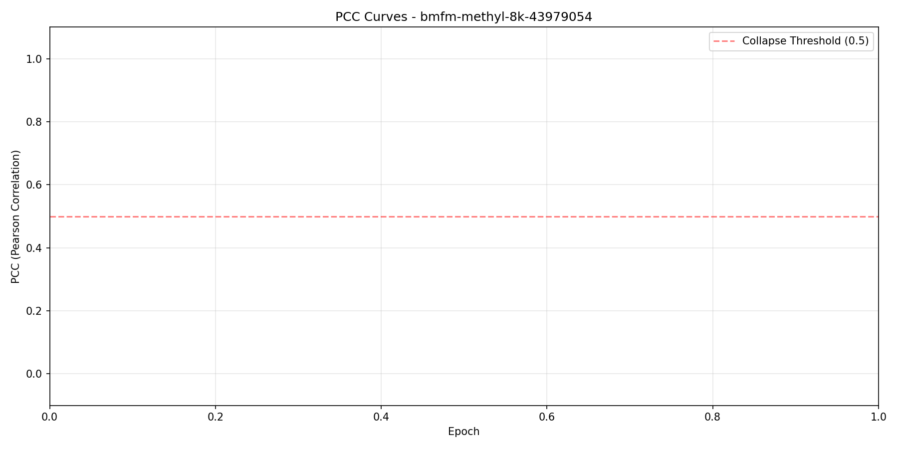

# Methylation Age Prediction with BMFM-RNA

<p align="center">
  
  
  
  
  
</p>

> Adapting IBM's BMFM-RNA foundation model architecture for DNA methylation-based biological age prediction, achieving state-of-the-art performance with **4.85 years MAE** and **92.3% explained variance**.

---

## Table of Contents

- [Overview](#overview)
- [Key Results](#key-results)
- [Architecture](#architecture)
- [Visual Results](#visual-results)
- [Methodology](#methodology)
- [Installation](#installation)
- [Usage](#usage)
- [Project Structure](#project-structure)
- [References](#references)

---

## Overview

DNA methylation patterns serve as a powerful biomarker for biological age, often referred to as the "epigenetic clock." This project adapts the **BMFM-RNA** (Biomedical Foundation Model for RNA) architecture for methylation-based age prediction.

### Why BMFM-RNA for Methylation?

| Aspect | Traditional Approaches | Our Approach |
|--------|----------------------|--------------|
| **Input Representation** | Flat vector of methylation values | Multi-field tokenization: CpG IDs + β-values |
| **Value Encoding** | Discretized bins | Continuous value encoder (preserves precision) |
| **Feature Learning** | Handcrafted features | Self-attention captures inter-CpG dependencies |
| **Transfer Learning** | Limited | Pretrained on 154K methylation profiles |

### Key Contributions

1. **Multi-field tokenization** for methylation data: `h_i = e_cpg(s_i) + e_beta(β_i)`
2. **Masked Language Model (MLM) pretraining** on large-scale methylation data (PCC = 0.997)
3. **Freeze-then-unfreeze** training strategy for effective transfer learning
4. **Comprehensive comparison** with MethylGPT baseline

---

## Key Results

### Performance Comparison

| Model | Test MAE (years) | Test R² | Parameters | CpG Sites |
|-------|------------------|---------|------------|-----------|
| Mean Prediction | 22.82 | 0.00 | — | — |
| MethylGPT (baseline) | 4.95 | 0.911 | ~2M | 8,000 |
| **BMFM-RNA (ours)** | **4.85** | **0.923** | ~23M | 8,000 |

### Key Findings

- **78% error reduction** compared to mean prediction baseline
- **2% improvement** in MAE over MethylGPT baseline
- **1.2% improvement** in R² (0.923 vs 0.911)
- Strong generalization with train-test gap of only ~2.6 years

### Pretraining Results

| Split | Loss | MSE | MAE | PCC |
|-------|------|-----|-----|-----|
| Train | 0.00132 | 0.00132 | 0.0221 | 0.994 |
| Validation | 0.00147 | 0.00147 | 0.0234 | 0.994 |
| Test | 0.00133 | 0.00087 | 0.0195 | **0.997** |

> PCC = 0.997 indicates the pretrained encoder accurately reconstructs masked β-values from context, learning meaningful methylation representations.

---

## Architecture

### Model Comparison

```
┌─────────────────────────────────────────────────────────────────────────────┐
│                        Architecture Comparison                               │
├────────────────────┬──────────────────┬──────────────────┬──────────────────┤
│ Parameter          │ BMFM-RNA (orig)  │ BMFM-RNA (ours)  │ MethylGPT        │
├────────────────────┼──────────────────┼──────────────────┼──────────────────┤
│ Layers             │ 12               │ 6                │ 6                │
│ Attention Heads    │ 12               │ 8                │ 4                │
│ Hidden Size        │ 768              │ 512              │ 64               │
│ FFN Size           │ 3072             │ 2048             │ 256              │
│ Parameters         │ ~110M            │ ~23M             │ ~2M              │
│ CpG Sites          │ —                │ 8,000            │ 8,000            │
└────────────────────┴──────────────────┴──────────────────┴──────────────────┘
```

### Multi-Field Tokenization

```
Input Sample:
  CpG Sites:    [cg00000029, cg00000108, cg00000165, ...]
  β-values:     [0.85,       0.23,       0.67,       ...]
                    │            │            │
                    ▼            ▼            ▼
              ┌─────────────────────────────────────────┐
              │         Multi-Field Embedding           │
              │                                         │
              │  h_i = e_cpg(s_i) + e_beta(β_i)        │
              │                                         │
              │  • e_cpg: Learned CpG site embedding   │
              │  • e_beta: Continuous value encoder    │
              └─────────────────────────────────────────┘
                    │            │            │
                    ▼            ▼            ▼
              ┌─────────────────────────────────────────┐
              │      6-Layer Transformer Encoder        │
              │      (8 heads, d=512)                   │
              └─────────────────────────────────────────┘
                              │
                              ▼
              ┌─────────────────────────────────────────┐
              │          Mean Pooling                   │
              │    (over content tokens, skip CLS)      │
              └─────────────────────────────────────────┘
                              │
                              ▼
              ┌─────────────────────────────────────────┐
              │      Age Regression Head                │
              │  MLP: 512 → 256 → 128 → 1              │
              │  + LayerNorm, GELU, Dropout(0.2)       │
              └─────────────────────────────────────────┘
                              │
                              ▼
                     Predicted Age
```

---

## Visual Results

### BMFM-RNA Training Curves

#### Pretraining (MLM on β-values)

<p align="center">
  
</p>

The encoder converges after ~150 epochs, achieving test loss = 0.00133 and PCC = 0.997.

<p align="center">
  
</p>

#### Fine-tuning (Age Regression)

<p align="center">
  
</p>

<p align="center">
  
</p>

<p align="center">
  
</p>

### MethylGPT Baseline Results

<p align="center">
  
  
</p>

<p align="center">
  
  
</p>

---

## Methodology

### Data

| Item | Description |
|------|-------------|
| **Pretraining Sources** | EWAS Data Hub; ClockBase |
| **Collected Profiles** | 226,555 |
| **After QC + Deduplication** | 154,063 |
| **Platforms** | Illumina 27K / 450K / EPIC |
| **CpG Harmonization** | 49,156 sites (≥5 EWAS traits and/or ≥95% presence) |
| **Fine-tuning Samples** | 11,453 (train/valid/test split) |
| **CpG Sites Used** | 8,000 per sample |
| **Age Range** | 0–100 years |

### Training Pipeline

#### Phase 1: Pretraining (MLM)

```yaml
Objective: Masked β-value reconstruction
Mask ratio: 25% of values masked
Epochs: 250
Optimizer: AdamW
Learning rate: 5e-4 with cosine decay
Output: Pretrained encoder weights
```

#### Phase 2: Fine-tuning (Age Regression)

```yaml
Objective: MSE on z-score normalized age
Freeze strategy:
  - Epochs 0-4: Encoder frozen (head learns)
  - Epochs 5+: Encoder unfrozen (10x lower LR)
Max epochs: 300
Early stopping: Patience = 60 on val/MAE
Batch size: 32 (effective 64 with accumulation)
Dropout: 0.2
Output: Age prediction model
```

### Critical Implementation Details

1. **Optimizer Bug Fix**: PyTorch Lightning's `configure_optimizers()` is called once at init. Frozen parameters are excluded from optimizer and won't be updated when unfrozen later. Fix: Include all parameters from start.

2. **Mean Pooling**: MLM pretraining doesn't train CLS token for aggregation. Mean pooling over content tokens works better for regression.

3. **Z-score Normalization**: Ages normalized to zero mean, unit variance for stable gradients.

---

## Installation

```bash
# Clone the repository
git clone https://github.com/netanelazran11/BiomedSciAI_ACL_Project.git
cd BiomedSciAI_ACL_Project

# Create environment
uv venv .venv -p3.12
source .venv/bin/activate

# Install dependencies
uv pip install -e .
cd methyl
pip install -r requirements.txt
```

---

## Usage

### Pretraining

```bash
# On SLURM cluster
sbatch scripts/pretrain_transformer.sh

# Or directly
python -m bmfm_methylation.pretrain_transformer \
    data_path=/path/to/methylation.h5ad \
    output_directory=./outputs/pretrain
```

### Fine-tuning

```bash
# On SLURM cluster
sbatch scripts/finetune_transformer_pretrained.sh

# Or directly
python -m bmfm_methylation.finetune_transformer \
    data_path=/path/to/methylation.h5ad \
    checkpoint_path=/path/to/pretrained.ckpt \
    output_directory=./outputs/finetune
```

### Configuration

Key configuration files in `bmfm_methylation/configs/`:

- `pretrain_config.yaml` - Pretraining hyperparameters
- `finetune_config.yaml` - Fine-tuning hyperparameters
- `model/scbert_methylation.yaml` - Model architecture
- `data_module/methylation.yaml` - Data loading settings

---

## Project Structure

```
methyl/
├── bmfm_methylation/
│   ├── configs/           # Hydra configuration files
│   │   ├── pretrain_config.yaml
│   │   ├── finetune_config.yaml
│   │   └── model/
│   ├── data_module.py     # Data loading and preprocessing
│   ├── tokenizer.py       # Multi-field tokenizer for CpG sites
│   ├── pretrain_transformer.py      # MLM pretraining
│   └── finetune_transformer.py      # Age regression fine-tuning
├── scripts/               # SLURM submission scripts
├── wandb_analysis/        # Training analysis and plots
│   ├── pretrain/          # Pretraining curves
│   └── finetune/          # Fine-tuning curves
├── docs/
│   ├── images/            # Result visualizations
│   └── methylation_age_report.tex   # Technical report
└── README.md              # This file
```

---

## Experiment Tracking

All experiments are tracked with Weights & Biases:

- **Pretraining**: [W&B Project - Pretrain](https://wandb.ai/netanelazran11-hebrew-university-of-jerusalem/pretrain-bmfm-rna-methylation-8k)
- **Fine-tuning**: [W&B Project - Finetune](https://wandb.ai/netanelazran11-hebrew-university-of-jerusalem/finetune-bmfm-rna-methylation-8k)
- **MethylGPT Baseline**: [W&B Project - MethylGPT](https://wandb.ai/netanelazran11-hebrew-university-of-jerusalem/methylGPT_8K_ElasticNet_Features)

---

## References

1. Ying, K., et al., "MethylGPT: a foundation model for the DNA methylome," *bioRxiv*, 2024.
2. Li, D., et al., "BMFM-RNA: A biomedical foundation model for single-cell transcriptomics," IBM Research, 2024.
3. Horvath, S., "DNA methylation age of human tissues and cell types," *Genome Biology*, 14(10):R115, 2013.
4. Hannum, G., et al., "Genome-wide methylation profiles reveal quantitative views of human aging rates," *Molecular Cell*, 49(2):359–367, 2013.
5. de Lima Camillo, L.P., et al., "AltumAge: A pan-tissue DNA methylation epigenetic clock based on deep learning," *npj Aging*, 8(1):1–15, 2022.

---

## Citation

If you use this code, please cite:

```bibtex
@misc{azran2025methylation,
  title={Methylation Age Prediction with BMFM-RNA Architecture},
  author={Azran, Netanel},
  year={2025},
  howpublished={\url{https://github.com/netanelazran11/BiomedSciAI_ACL_Project}}
}
```

---

<p align="center">
  <b>Hebrew University of Jerusalem | Biomedical Foundation Models Lab</b>
</p>
